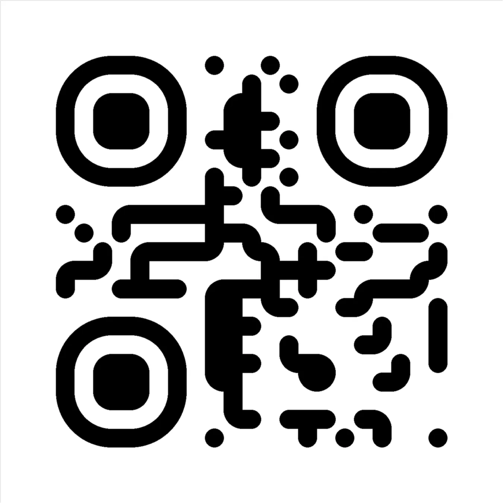
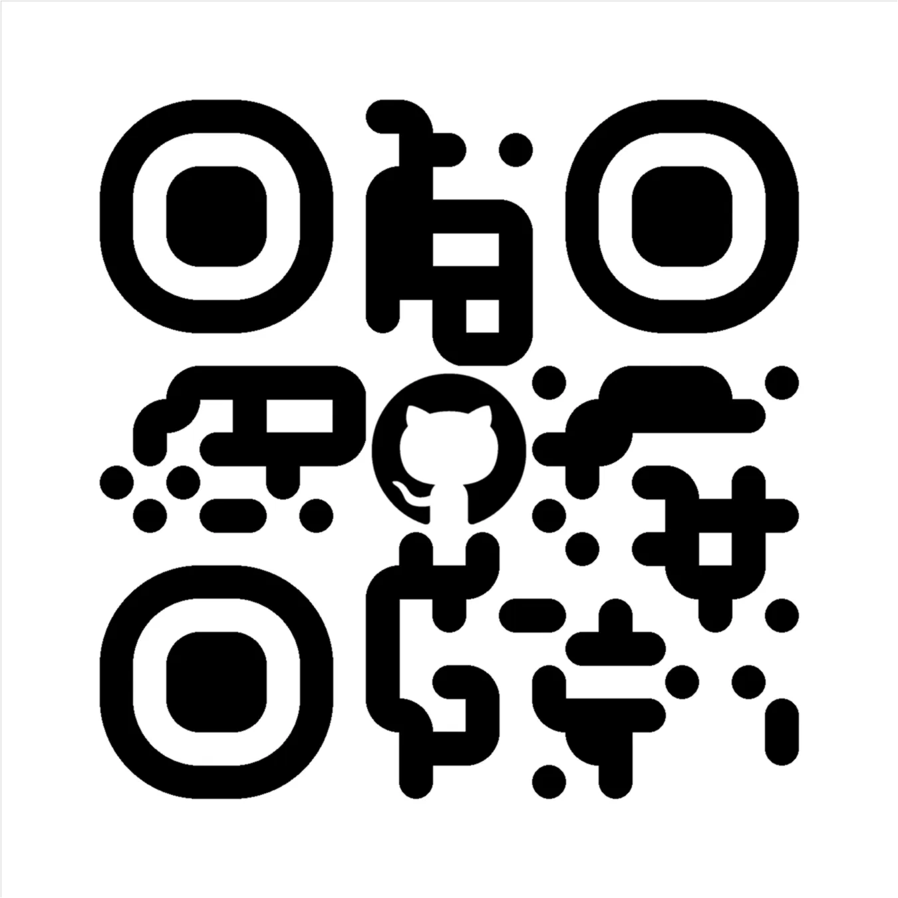

# QR Code Generator API

## Overview

FastAPI-based API for generating QR codes with optional image inclusion. It supports both base64-encoded data and plain
text. The API is designed to be fast, efficient, and easy to use, making it suitable for a variety of applications.

## Features

- Generate QR codes with optional image inclusion.
- Support for both base64-encoded data and plain text.
- Dockerized for easy deployment.
- Asynchronous HTTP requests with aiohttp.
- Utilizes caching for improved performance.

## Live API Site

Access the QR Code API live at [qrcode.ness.su](http://qrcode.ness.su).

## Requirements

Ensure you have the following dependencies installed:

- [aiohttp](https://aiohttp.readthedocs.io/) (version 3.8.6)
- [cachetools](https://pypi.org/project/cachetools/) (version 5.3.2)
- [fastapi](https://fastapi.tiangolo.com/) (version 0.104.1)
- [lxml](https://lxml.de/) (version 4.9.3)
- [pillow](https://pillow.readthedocs.io/) (version 10.1.0)
- [qrcode-styled](https://pypi.org/project/qrcode-styled/) (version 0.2.2)
- [starlette](https://www.starlette.io/) (version 0.27.0)
- [uvicorn](https://www.uvicorn.org/) (version 0.24.0)

## Installation

1. Clone the repository:

    ```bash
    git clone https://github.com/nessshon/qrcode-fastapi.git
    ```

2. Change into the project directory:

    ```bash
    cd qrcode-fastapi
    ```

3. Build the Docker image:

    ```bash
    docker build -t qrcode-fastapi .
    ```

4. Run the Docker container:

    ```bash
    docker run -p 8000:8000 qrcode-fastapi
    ```

5. Access the API at [http://localhost:8000](http://localhost:8000)

## Usage

### Endpoint: `/create`

- **Method**: `GET`
- **Parameters**:
    - `data`: Data or base64 encoded data to be encoded in QR code.
    - `image_url`: URL or base64 encoded URL of the image to be included in the QR code (optional).
    - `border`: QR code border size (0 to 50).
    - `box_size`: QR code box size (20 to 100).
- **Response**: Generated QR code image in PNG format.

## Example Generated QR Code Images

Here are some example QR code images generated using the Ness API. Feel free to scan these codes or use the provided
URLs to see the results.

### Text Only and Base64-Encoded Text



### Image URL and Base64-Encoded Image URL



## License

This project is licensed under the MIT License - see the [LICENSE](LICENSE) file for details.

## Acknowledgments

This project utilizes the following dependencies:

- [aiohttp](https://aiohttp.readthedocs.io/) - Asynchronous HTTP client/server framework.
- [cachetools](https://pypi.org/project/cachetools/) - Extensible memoizing collections and decorators.
- [fastapi](https://fastapi.tiangolo.com/) - Modern, fast (high-performance), web framework for building APIs with
  Python 3.7+.
- [lxml](https://lxml.de/) - XML and HTML processing library.
- [pillow](https://pillow.readthedocs.io/) - The Python Imaging Library adds image processing capabilities to your
  Python interpreter.
- [qrcode-styled](https://pypi.org/project/qrcode-styled/) - A QR Code generator with styles.
- [starlette](https://www.starlette.io/) - ASGI framework/toolkit for building high-performance asyncio services.
- [uvicorn](https://www.uvicorn.org/) - ASGI server implementation, using uvloop and httptools.